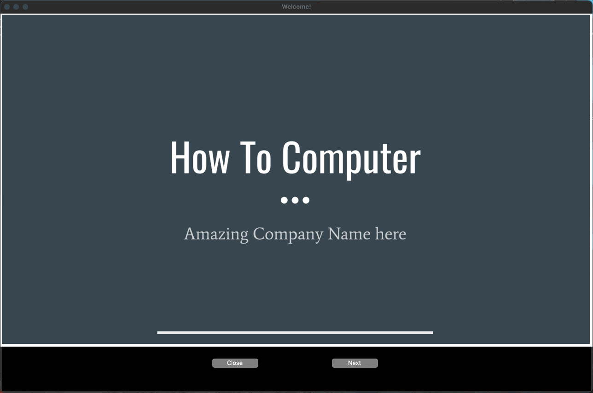
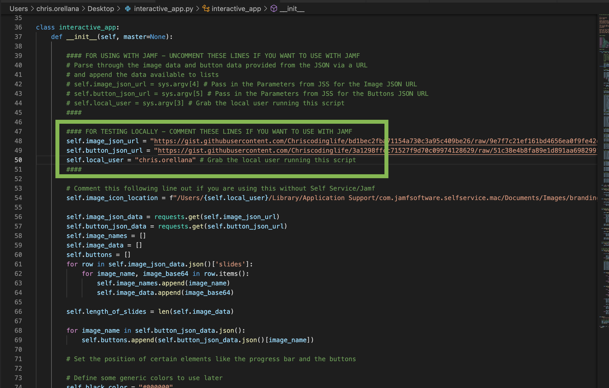
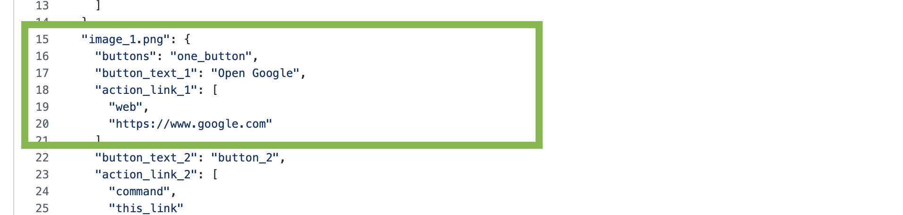
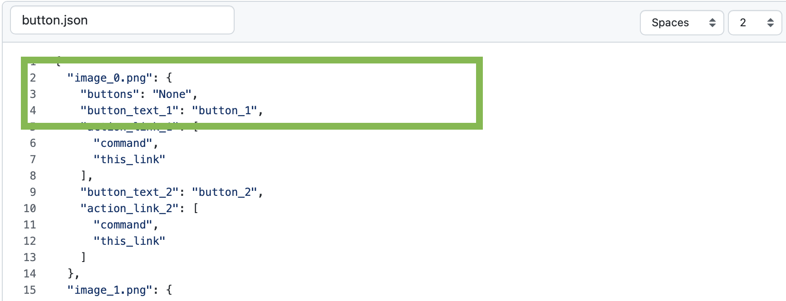
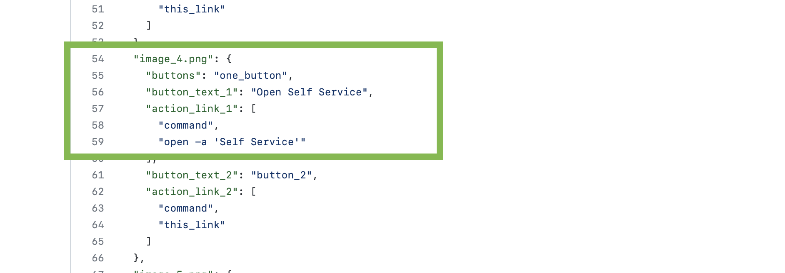

# Interactive Presentation Python App

## Purpose of the App - Make your presentations _interactive_!

### Getting people to do the same task on multiple machines is hard work...

Recently I found that onboarding new hires at any company can be a tidious and annoying task, Onboarding usually takes a similar approach at most companies where on day 1 users are asked to join a Zoom call, watch a presentation on how to setup their laptop or computer for their job, and hopefully by the end of the presentation they are ready to go. But this usually isn't the case...

What really ends up happening is that there are some stragglers in the group, others with questions, and others who are completely lost. Asking a large group to follow along with a presentation and have them manually set up their machines can be annoying, repetitive, and mundane. So I created this app to help mitigate this and get everyone on the same page quick.

If you are an IT Admin/team member who has to jump on a Zoom call every week to onboard new employees, you understand where I am coming from. This app is ideal for you. If you run a Google Slide/ PowerPoint presentation and have a rundown of tasks to complete with new hires, you can easily use this app to help setup on day 1. 

## How to Use

### Step 1 - Please enable your Google Slides API.
You will need to setup access to your Google API for your account in order to convert Google Slides into downloadable images as you will need a local credential and token file for talking to the API. I highly suggest following the Google Slides Python Get Started Guide here: [quickstart](https://developers.google.com/slides/api/quickstart/python)

### Step 2 - Run the generator script
Please use the generator_slide_script that can generate the following Json files for you:

1. The Presentation Data Json - This json will contain all the base64 image data for you
2. The Button Json - This json will contain all the URL, and command information that you want your users to click on.

### Step 3 - Upload your Presentation and Button json data to gists on Github.

This step is really up to you how you want to distribute this data but this is essential for the script as it expects a URL.

You are essentially going to want two Raw Gist urls to pass into the interactive_app.py script.

Add the presentation Gist to the self.image_json_url variable and the button data gist to the self.button_json_url variable

Then add your username for your local account for the self.local_user variable since you will be testing this script locally.

### Step 4 - Edit the Button JSON to tailor to your presentation.

The real fun (or work) starts here. In this example I have the following slides:

1. Ask user to open Google
2. Ask user to open Yahoo
3. Ask user to open Zoom app 
4. Ask user to Run Self Service

#### Key Configs
Each slide can have a maximum of two buttons each with leaving the "buttons" key to "true", but if you only want one button, set the "buttons" key to "one_button."

If you don't want any buttons, set the value for the "buttons" key to "None"

For opening web sites with the default browser set on the user's home environment, set the action link key from "command" to "web"

For running a specific local command as the user leave "command"

For running a command such as opening an app do the following
`open -a <App/location> or <app_name>`

For example `open -a "Zoom"`

### Step 5 - Make sure to update your Gist urls

Each time you edit your Gists, it will generate a new Gist url that you need to pass into your variables. Update them now!

### Step 6 - Test run your script

Here I show a quick example of running the script and having the app appear on screen:

## Current issues/limitations/Possible Todos

1. This script is currently designed to work only in a Mac environment
2. The Tkinter gui is locked down to a 1280 to 720 resolution. There are some hints in the script logic where I tried to tailor it to different resolutions
3. Python Memory management sucks, so when you have longer presentations, your base64 image data will be a lot larger and can possibly slow your machine down. Just a warning of caution as you proceed.
4. The script is limited to two buttons!
6. Button color customization and progress bar is very limited!!